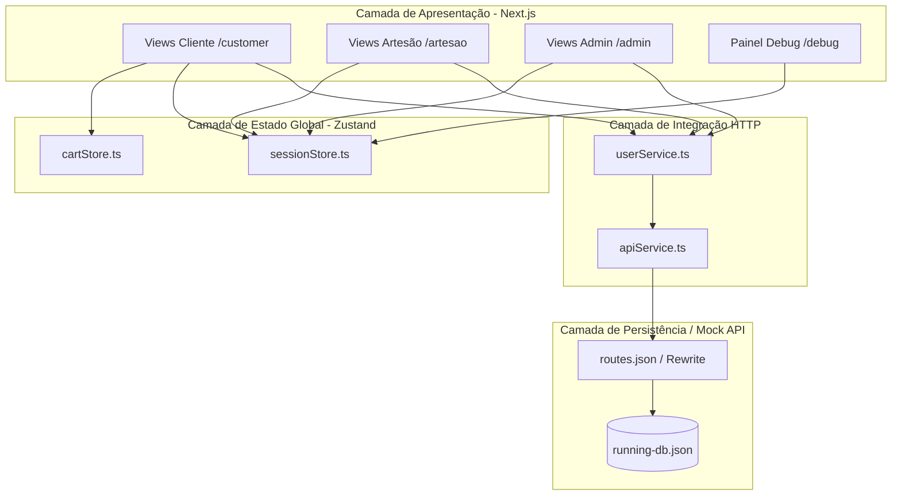
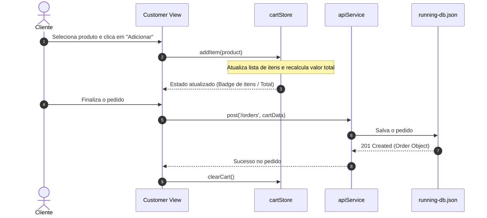

# Documento de Design de Arquitetura: FolcStore

## 1. Estratégia Principal e Baseline Architecture

O **FolcStore** adota uma arquitetura em camadas orientada a componentes no frontend (Next.js App Router), desacoplada do backend por meio de uma camada de serviços HTTP.

* **Baseline Atual:** Protótipo funcional com chamadas assíncronas consumindo um backend simulado via JSON Server (`running-db.json`, `routes.json`). O estado global é gerenciado no cliente com *Zustand*.
* **Estratégia Principal:** Prover uma transição transparente da API mock para microsserviços reais em produção sem alterar os componentes visuais, mantendo o contrato mantido pela camada de serviços (`src/services/`).

### Justificativa do Stack Tecnológico
* **Linguagem (TypeScript):** Garante segurança de tipos de ponta a ponta, compartilhando as interfaces de dados (`src/types/`) entre os componentes da interface e as chamadas de API.
* **Framework (Next.js - App Router):** Permite renderização híbrida (SSR/SSG/CSR) e rotas organizadas por contexto de domínio (`/customer`, `/artesao`, `/admin`).
* **Gerenciamento de Estado (Zustand):** Adotado para as stores `cartStore` e `sessionStore` devido ao seu custo computacional baixo e reatividade sem *boilerplate* redundante.
* **Banco de Dados (Baseline: JSON Server / Produção: PostgreSQL):** Para a baseline, o `running-db.json` viabiliza testes rápidos e persistência local durante o desenvolvimento.

---

## 2. Organização do Projeto

A estrutura de diretórios do repositório está disposta da seguinte forma:

```text
FolcStore-main/
├── docs/
│   └── uso-de-ia.md            # Documentação de uso de IA na aplicação
├── public/                     # Ativos estáticos e vetoriais
├── src/
│   ├── app/                    # Rotas organizadas por perfil de acesso (App Router)
│   │   ├── admin/              # Painel e autenticação do administrador
│   │   ├── artesao/            # Cadastro, login e gestão do artesão
│   │   ├── customer/           # Vitrine, checkout e conta do cliente
│   │   ├── debug/              # Painel de diagnósticos da aplicação
│   │   ├── globals.css         # Estilos globais
│   │   ├── layout.tsx          # Wrapper principal do Next.js
│   │   └── provider.tsx        # Provedor global de contextos
│   ├── services/               # Abstração de integração HTTP
│   │   ├── apiService.ts       # Cliente Fetch com rotas dinâmicas (`routes.json`)
│   │   └── userService.ts      # Serviços CRUD para artesãos, clientes e admins
│   ├── store/                  # Estado reativo global
│   │   ├── cartStore.ts        # Gerenciamento de itens e preços do carrinho
│   │   └── sessionStore.ts     # Autenticação e perfil ativo
│   ├── types/                  # Contratos e modelos de dados do sistema
│   │   ├── admin.ts            # Entidade Admin
│   │   ├── artesao.ts          # Entidade Artesão
│   │   ├── customer.ts         # Entidade Cliente
│   │   ├── product.ts          # Entidade Produto
│   │   └── index.ts            # Ponto único de exportação de tipos
│   └── theme.ts                # Configuração do tema estrutural da interface
├── base-db.json                # Snapshot inicial do banco de dados
├── running-db.json             # Instância ativa do banco JSON Server
└── routes.json                 # Reescrita de URLs da API (`/api/v1/*` -> `/$1`)
```

---

## 3. Diagrama de Componentes



---

## 4. Fluxo de Dados

### Fluxo de Autenticação e Cadastro
1. O usuário envia as credenciais/dados na interface correspondente (`/artesao/login`, `/customer/register`, etc.).
2. A view aciona uma função em `userService.ts`.
3. O `userService` invoca `apiService.ts`, aplicando tratamento de requisição e prefixando a URL base da API (`/api/v1/`).
4. O middleware do `routes.json` redireciona a chamada para a coleção de dados em `running-db.json`.
5. Em caso de sucesso, o perfil retornado é persistido no `sessionStore`.

### Fluxo de Compra e Carrinho


---

## 5. Modelo de Dados

### Entidade: `Product` (`src/types/product.ts`)
* `id` (string): Identificador único do produto.
* `title` (string): Nome do artesanato.
* `description` (string): Detalhamento técnico/artístico.
* `price` (number): Valor monetário.
* `artesaoId` (string): Chave estrangeira para o artesão responsável.
* `stock` (number): Quantidade disponível.
* `imageUrl` (string, opcional): URL da imagem do produto.

### Entidades de Usuário (`src/types/`)
* **`Customer`:** `id`, `name`, `email`, `cpf`, `phone`, `address`.
* **`Artesao`:** `id`, `name`, `email`, `cpfCnpj`, `bio`, `specialty`, `phone`.
* **`Admin`:** `id`, `name`, `email`, `role`, `permissions`.

---

## 6. Interface de Integração

### Especificação do Contrato: Cadastro e Atualização de Produtos

* **End-point:** `/api/v1/products`
* **Método HTTP:** `POST`
* **Descrição:** Cria um novo produto associado a um artesão autenticado.

#### Campos de Entrada (Input)
| Campo | Tipo | Obrigatório | Descrição |
| :--- | :--- | :--- | :--- |
| `title` | string | Sim | Nome comercial do produto artesanal. |
| `description`| string | Sim | Descrição dos materiais e modo de fabricação. |
| `price` | number | Sim | Valor positivo unitário do item. |
| `artesaoId` | string | Sim | ID do artesão proprietário cadastrado. |
| `stock` | number | Sim | Quantidade em estoque no momento do cadastro. |

#### Campos de Saída (Output - Sucesso `201 Created`)
| Campo | Tipo | Descrição |
| :--- | :--- | :--- |
| `id` | string | UUID/ID único gerado pelo banco. |
| `title` | string | Nome do produto cadastrado. |
| `description`| string | Descrição mantida. |
| `price` | number | Valor cadastrado. |
| `artesaoId` | string | ID do artesão vinculado. |
| `stock` | number | Quantidade estocada. |
| `createdAt` | string | Timestamp ISO da criação. |

#### Possíveis Erros
* `400 Bad Request`: Dados obrigatórios ausentes ou `price`/`stock` inválidos.
* `401 Unauthorized`: Sessão do artesão expirada ou token ausente.
* `404 Not Found`: `artesaoId` informado não corresponde a um artesão válido.
* `500 Internal Server Error`: Falha inesperada de escrita no banco.

#### Exemplo de Requisição (Payload JSON)
```json
{
  "title": "Vaso de Argila Trançada",
  "description": "Vaso feito manualmente com barro cozido e acabamento rústico.",
  "price": 149.90,
  "artesaoId": "art-9821",
  "stock": 5
}
```

#### Exemplo de Resposta (JSON Sucesso `201 Created`)
```json
{
  "id": "prod-4410",
  "title": "Vaso de Argila Trançada",
  "description": "Vaso feito manualmente com barro cozido e acabamento rústico.",
  "price": 149.90,
  "artesaoId": "art-9821",
  "stock": 5,
  "createdAt": "2026-09-15T14:30:00Z"
}
```

---

## 7. Localização do Módulo de IA e Pontos de Integração

A integração com Inteligência Artificial foi documentada em `docs/uso-de-ia.md`.

* **Localização Prevista:** `src/services/aiService.ts` com ponto de chamada nos formulários do artesão (`src/app/artesao/page.tsx`).
* **Pontos de Integração:**
  1. **Geração de Descrições:** Auxiliar artesãos na escrita de textos descritivos e apelativos a partir do título do produto.
  2. **Categorização Automática:** Sugestão de tags para o produto antes da persistência via `apiService.ts`.

---

## 8. Tratamento de Erros e Contingência

* **Intercepção de Erros:** O módulo `apiService.ts` captura falhas de rede (`fetch`) e converte respostas HTTP não bem-sucedidas (`!res.ok`) em exceções estruturadas.
* **Estratégia de Contingência (Fallback):**
  * Caso o backend remoto ou mock esteja fora do ar, o `cartStore` mantém o estado do carrinho no `localStorage` para evitar perda de dados da navegação do cliente.
  * O painel de debug (`/debug`) permite inspecionar e restaurar manualmente o estado do banco e das sessões.

---

## 9. Segurança, Privacidade e Observabilidade

* **Segurança de Sessão:** O estado da sessão gerenciado pelo `sessionStore` expõe dados em memória e sincroniza apenas tokens/perfil básico.
* **Privacidade de Dados:** Senhas e dados sensíveis (CPF/CNPJ) não são expostos nas respostas globais de listagens e devem ser sanitizados antes de serem retornados ao frontend.
* **Observabilidade:** O ambiente conta com a rota diagnóstica `/debug` que exibe em tempo real o estado atrelado aos *stores* de sessão, dados persistidos no banco local e métricas de log do cliente Next.js.

---

## 10. Ambiente de Execução e Restrições Técnicas

* **Ambiente do Cliente**: Navegadores modernos com suporte a ES6 e suporte a LocalStorage / Fetch API.

* **Ambiente Server/Dev**: Node.js v18+, gerenciador de pacotes npm, executando concorrentemente next dev e json-server --watch running-db.json --routes routes.json.

* **Restrições Conhecidas**: A persistência baseada em running-db.json não é thread-safe para operações simultâneas de escrita concorrente em ambientes de produção real.
"""